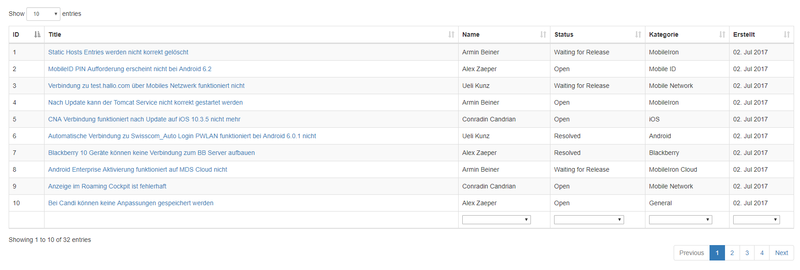

# keClient

## Einleitung

Das keClient Projekt stellt die Client Seite für eine Known Error Datenbank dar.
Fehler werden vom Express Server abgerufen und gerendert.

Neue Fehler und neue Worklogs zu bestehenden Fehlern können erfasst und auf dem Server gespeichert werden.

Das dazugehörige Projekt für die Server Seite ist unter folgendem Link zu finden:

[Pojekt keServer](https://github.com/ibwgr/keServer)

## Entwicklung

Als Grundlage für den Client wird Node.js mit [gulp](http://gulpjs.com/) verwendet.

Weitere Libraries und Erweiterungen die bei der Entwicklung zum Zug kamen:

- [Bootstrap](http://getbootstrap.com/) - Hauptsächlich für Design verwendet
- [jquery](https://jquery.com/)  - Abhängigkeiten von Bootstrap Tables zu jquery
- [datatables.net](https://datatables.net/)  - jquery Plugin für erweiterte Table Funktionen
- [datatables.net-bs](https://datatables.net/manual/styling/bootstrap) - Bootstrap Styling für Datatables
- [request](https://github.com/request/request)  - Einfache Lösung um http calls auszuführen

## Installation

Alle nötigen Dependencies wurden im package.json File erfasst. Nach dem Pull können aus dem Projekt mit yarn install die benötigten Ergänzungen installiert werden.

Sollten hierbei unerwartet Probleme auftauchen, können die Module auch manuell installiert werden:

```
npm install bootstrap@3

npm install jquery

npm install datatables.net

npm install datatables.net-bs

npm install gulp

npm install request
```

## Starten des Servers

Ist die Installation abgeschlossen, kann der Server mit dem Befehl gulp gestartet werden.
WICHTIG: Ist der gulp Befehl nicht als Variable im OS definiert, muss in den node_modules/.bin Folder gewechselt werden.

Der Server ist läuft auf localhost:8008. Um direkt auf die Startseite zu gelangen kann http://localhost:8008/src aufgerufen werden.

## GUI und Funktionen

Die Startseite (/src) sieht folgendermassen aus:


Der Title eines jeweiligen Known Errors ist ein Link der in eine Detail View wechselt, in welcher die erfassten Worklogs für den spezifischen Known Error angezeigt werden:


### Suchfunktion

Um eine Suche auszuführen, kann der gewünschte Text im markierten Suchfeld in der navbar eingegeben werden. Die Suche wird ausgeführt sobald die Enter Taste betätigt wird. Es werden der Titel der Known Errors sowie der Titel und die Beschreibung der Worklogs durchsucht.


### Hinzufügen eines neuen Known Errors

Ein neuer Eintrag für einen Known Error kann direkt auf der Startseite hinzugefügt werden. Dazu muss im Title Feld ein Text erfasst werden und die gewünschten Werte in den Drop Down Feldern ausgewählt werden. Sobald der "Add" Link in der navbar angeklickt wird, wird der erfasst Text als Known Error gespeichert.


### Filtern und sortieren, Anzeige anpassen

Filter können über die Drop Down Felder am unteren Ende der Seite ausgewählt werden. Die Kombination von mehreren Filtern ist möglich.
Die Sortier Funktion befindet sich in den Table Headers.

Über das "Show x entries" Menü kann eingestellt werden, was für eine Anzahl Known Errors auf der Startseite angezeigt werden soll.
Die Navigation für die nächste Seite befindet sich unten rechts



### Hinzufügen eines neuen Worklogs

Um einen neuen Worklog zu erfassen, muss in die Detailansicht vom Known Error gewechselt werden (Klick auf "Title" des entsprechenden Fehlers). In der Detailansicht kann auf "Add Worklog" geklickt werden. Dies klappt eine Eingabemaske auf. Dort können die gewünschten Daten erfasst und mit dem Klicken auf "Save" gespeichert werden


### Allgemeine Infos zu den Funktionen

Um den Status eines bestehenden Known Errors anzupassen, muss ein neuer Worklog erfasst werden. Eine Statusänderung ohne ein Update (in Form eines Worklog Eintrags) ist NICHT möglich.

Der Title eines Known Errors muss "Unique" sein. Bei den Worklog Einträgen gibt es diese Einschränkung nicht.

WICHTIG: Einmal erfasste Einträge können nicht mehr geändert werden. Nur der Status eines Known Errors kann nach Erfassung angepasst werden.

Dies ist bewusst so umgesetzt, damit nicht nachträglich die History eines Known Errors verändert werden kann.

## Tests

Es wird getestet ob die render Funktionen, welche html ausgeben, das richtige Ergebnis liefern.

Testframework: mocha

Testmodul installieren

    yarn add -D mocha
    yarn add -D babel-register

Startskript in package json:
        
    "test": "./node_modules/.bin/mocha --require babel-register src/test/renderTests.js" 

Starten der Tests: 

    npm test

## To Do
- Encoding / Escaping ergänzen
- Tests implementieren
- Verbesserung des Exception Handling
- Filter Implementierung nach Suche (Im Moment können Filter nur in der Startseite verwendet werden. Bei Suchergebnissen ist im Moment kein Filtering möglich)

## Autoren

- Alex Zaeper
- Armin Beiner

## Lizenz

MIT License

Copyright (c) 2017 Alex Zaper, Armin Beiner

Permission is hereby granted, free of charge, to any person obtaining a copy of this software and associated documentation files (the "Software"), to deal in the Software without restriction, including without limitation the rights to use, copy, modify, merge, publish, distribute, sublicense, and/or sell copies of the Software, and to permit persons to whom the Software is furnished to do so, subject to the following conditions:

The above copyright notice and this permission notice shall be included in all copies or substantial portions of the Software.

THE SOFTWARE IS PROVIDED "AS IS", WITHOUT WARRANTY OF ANY KIND, EXPRESS OR IMPLIED, INCLUDING BUT NOT LIMITED TO THE WARRANTIES OF MERCHANTABILITY, FITNESS FOR A PARTICULAR PURPOSE AND NONINFRINGEMENT. IN NO EVENT SHALL THE AUTHORS OR COPYRIGHT HOLDERS BE LIABLE FOR ANY CLAIM, DAMAGES OR OTHER LIABILITY, WHETHER IN AN ACTION OF CONTRACT, TORT OR OTHERWISE, ARISING FROM, OUT OF OR IN CONNECTION WITH THE SOFTWARE OR THE USE OR OTHER DEALINGS IN THE SOFTWARE.
